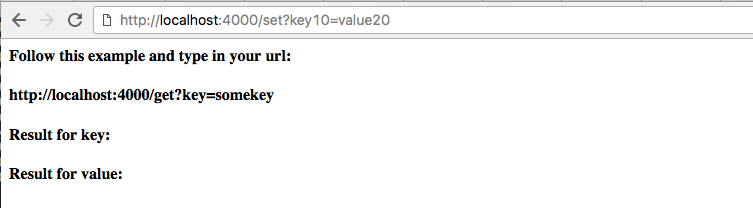
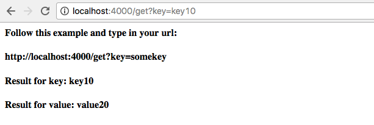
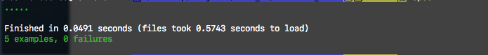

## Tasks

You receive a message from a prospective employer:

"Before your interview, write a program that runs a server that is accessible on http://localhost:4000/. When your server receives a request on http://localhost:4000/set?somekey=somevalue it should store the passed key and value in memory. When it receives a request on http://localhost:4000/get?key=somekey it should return the value stored at somekey. Store the data in memory, not in a database, but bear in mind that you will later need to add a database to this code."

Create a new git repository and write code to fulfill the brief to the best of your ability. We will be looking for clean, well tested code in your choice of technology. In addition, the last sentence of the brief implies that you should consider how the code could easily be extended to add an as-yet-unknown data store.

If you still have time at the end of the day, you can extend the code by adding a data store of your choice.

## Approach to problem  

 - I chose to use Ruby and Sinatra for this problem because all I need was a simple server, which could deal with two requests to get and set data.
 - First step was to think about the typical MVC structure, but instead of using a classic database model, I choose to create a data storage class with an empty hash property.
 - Once the server was connected tot the DataStore class, I created a way of initializing a new database from the browser and setting it to a global variable.This was then refactored to store the DataStore instance as a session, which is created on the first /set?request.

## Insttructions

* In the terminal start the server: 
  - rackup
* In your browser:
  - localhost: 4000
* This takes you to the home page:

  

* Set the key
  - http://localhost:4000/set?key10=value20

  

* Get the key
  - http://localhost:4000/get?key=key10

  

  ## Test coverage:

  
